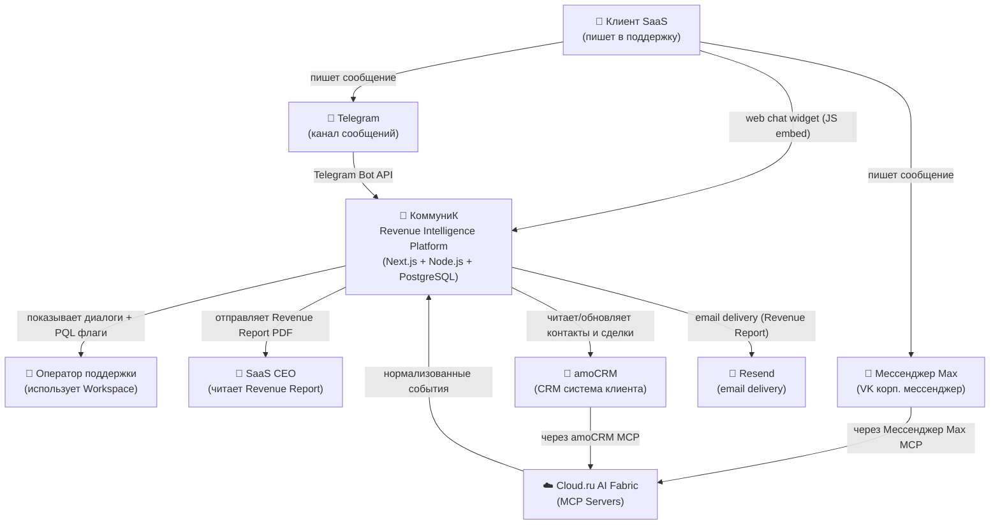
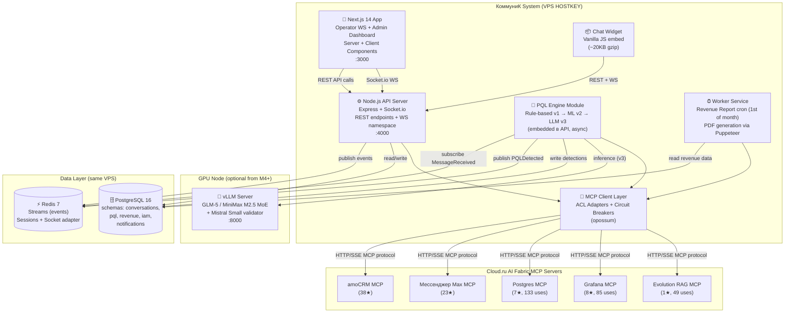
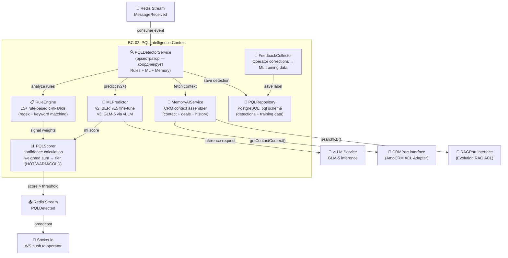
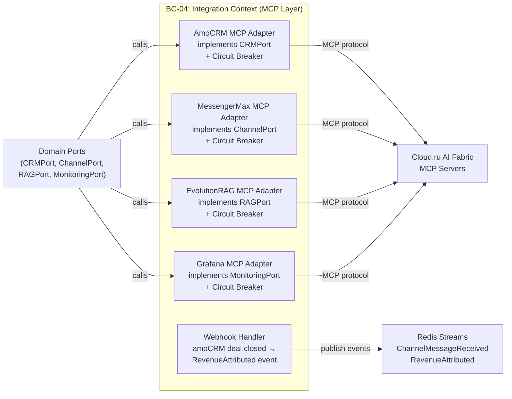

# C4 Architecture Diagrams: КоммуниК
**Version:** 1.0 | **Date:** 2026-03-04

---

## C4 Level 1: System Context



---

## C4 Level 2: Container Diagram



---

## C4 Level 3: Component — PQL Intelligence BC



---

## C4 Level 3: Component — Integration Context (MCP Layer)



---

## Deployment Diagram (Docker Compose на VPS)

```
VPS HOSTKEY (минимум 8GB RAM, 4 vCPU)
├── docker-compose.yml
│   ├── app (Next.js 14 + Node.js API)    port 3000, 4000
│   │   └── embeds: PQL Engine + MCP Layer + Worker
│   ├── postgres (PostgreSQL 16)           port 5432 (internal)
│   ├── redis (Redis 7)                    port 6379 (internal)
│   └── nginx (reverse proxy + SSL)        port 80, 443
│
├── Volumes:
│   ├── postgres_data
│   ├── redis_data
│   └── uploads (chat attachments)
│
└── Networks:
    ├── internal (app ↔ postgres ↔ redis)
    └── external (nginx → internet)

GPU Node (опционально с M4+, VPS HOSTKEY GPU)
└── docker-compose.gpu.yml
    └── vllm (GLM-5 + Mistral Small)       port 8000 (internal VPN)
```
